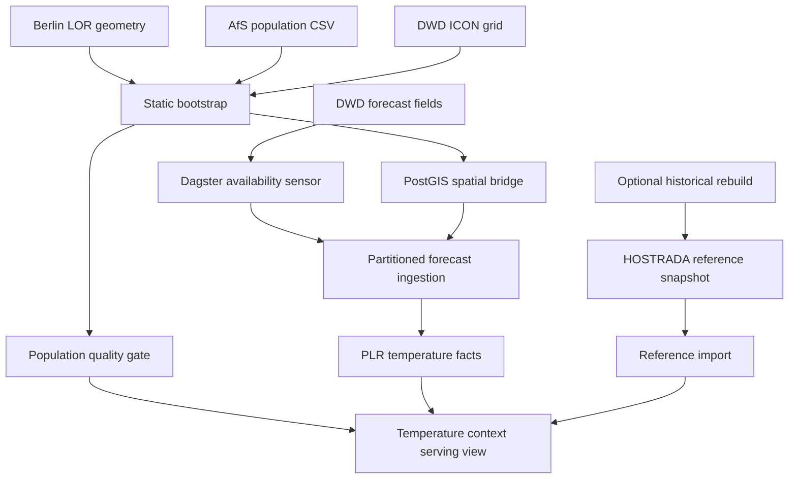

# Architecture

## Problem and serving grain

Urban-planning and public-health analysts need neighborhood-level temperature
observations, historical context, and population counts on the same spatial
and temporal grain. The pipeline serves facts from which analysts can make
their own comparisons; it does not assert a medical risk classification.

One final serving row represents one current Berlin planning area, one forecast
run, and one forecast lead time. Forecast valid time is derived from run time
plus lead time. Historical reference values are matched to the corresponding
Berlin-local calendar month, day, and hour.

## System overview



Python owns source-specific acquisition, GRIB/NetCDF decoding, and operational
coordination. PostgreSQL/PostGIS owns durable relational state, spatial
intersections, constraints, set-based transformations, and serving views.
Dagster owns asset lineage, partition execution, quality checks, run history,
and source-aware triggering. Docker isolates PostgreSQL/PostGIS; the application
uses a reproducible `uv` environment.

This is a source-aware **batch pipeline** with hourly forecast partitions. It
is not a streaming platform, medical decision system, or dashboard product.

## Source systems

| Source | Grain | Refresh behavior | Operational role |
| --- | --- | --- | --- |
| Berlin LOR planning areas | 542 polygons, geography dated 2023-01-01 | Slowly changing | Stable PLR identifiers and geometry. |
| Berlin PLR name directory | 542 planning-area identifiers and names | Slowly changing | Analyst-facing neighborhood labels only. |
| AfS population register | PLR, reference date 2025-12-31 | Slowly changing | Total residents and residents aged 65+. |
| DWD ICON grid 0047 | 542,040 cells and 272,089 vertices | Static model grid | Forecast-cell geometry and spatial bridge. |
| DWD ICON-D2-RUC | Forecast run, lead time, grid cell, indicator | Rolling forecast publication | Temperature, humidity, and wind fields. |
| DWD HOSTRADA | Historical hour and 1 km grid cell | Historical reference, 1995–2025 | Neighborhood and Berlin historical comparisons. |

Operational installation imports the completed HOSTRADA reference. Original
historical NetCDF files, the HOSTRADA spatial bridge, and historical hourly
tables are required only when deliberately reconstructing that reference.

## Durable data layers

| PostgreSQL schema | Responsibility | Representative relations |
| --- | --- | --- |
| `raw` | Source-faithful records and ingestion provenance. | `lor_plr`, `afs_population`, `icon_grid_source`, `icon_d2_ruc_field` |
| `normalized` | Validated geometry, accepted/rejected population, spatial weights, and normalized forecast fields. | `plr`, `plr_population_65plus`, `plr_population_rejected`, `icon_cell`, `icon_plr_area_bridge`, `icon_weather_mask`, `icon_d2_ruc_weather` |
| `analytical` | PLR-level temperature facts, historical reference tables, analyst-facing labels, and consumer-facing views. | `plr_weather_population`, `plr_display_name`, `hostrada_plr_hourly_reference`, `hostrada_berlin_hourly_reference`, `current_plr_weather_context` |

Raw forecast GRIB files also remain on the filesystem. Their stable directory
layout mirrors `(run_time_utc, lead_time, indicator)` and permits reprocessing
after DWD removes an older run from its rolling source window.

## Static initialization

The supported operational entry point is:

```bash
uv run --env-file .env python -m src.bootstrap \
  --reference-archive /path/to/hostrada-reference-1995-2025.pgcustom
```

It first checks the archive bytes against the committed manifest, before
starting expensive static processing. It then:

1. Applies `sql/bootstrap_schema.sql` once to an empty database, or verifies
   that an existing database already satisfies the canonical schema contract.
2. Acquires LOR geometry, population data, and the ICON grid; an optional
   static-source archive supplies a verified fallback.
3. Runs the Dagster `operational_static_bootstrap` job and validates the
   resulting geometry, population, spatial bridge, and Berlin forecast mask.
4. Confirms that installed PLR identifiers match the reference geography
   fingerprint.
5. Restores the two historical-reference tables in one PostgreSQL transaction.
6. Validates the imported reference independently of historical source
   manifests or 1995–2025 hourly observations.
7. Installs 542 verified PLR display names for the final analyst-facing views.

On the development laptop, the first clean-room installation took
approximately ten minutes. Its largest one-time operation was processing the
ICON grid: 272,089 vertices, 542,040 cells, and 1,626,120 topology records.

## Forecast identity and ingestion

The canonical forecast key is:

```text
run_time_utc + lead_time
```

`valid_time_utc = run_time_utc + lead_time`. Run labels such as
`20260824T1600` always represent UTC. A Dagster sensor examines only recent
advertised DWD runs and triggers a partition when all four required fields are
present:

- `T_2M`: air temperature.
- `RELHUM_2M`: relative humidity.
- `U_10M`: east-west wind component.
- `V_10M`: north-south wind component.

The sensor checks during minutes `:30`–`:59`, is stopped by default, and must
be enabled explicitly. Manual execution performs the same source-completeness
preflight while still allowing complete retained raw partitions to be
reprocessed without contacting DWD.

The forecast pipeline retains and validates full GRIB source fields, selects
the 465 Berlin forecast-mask cell indices from each decoded array in Python,
and copies only those values into PostgreSQL. It then computes shade apparent
temperature and area-weights both temperature measures to PLRs. Full-grid
point counts and missing-value accounting remain recorded in the source
manifest even though nationwide values do not cross the database boundary.

## Spatial and population contracts

Forecast grid cells and PLRs use different geometries. PostGIS constructs a
many-to-many intersection bridge in EPSG:25833; PLR temperature is weighted by the
fraction of each planning area's area represented by each intersecting cell.
Bridge checks protect complete PLR coverage and weight totals.

Population records are validated before entering the analytical layer. The
observed source contains 542 PLR records: 540 accepted and two rejected. A
rejected record remains represented in the final view with null population
counts and `population_status = 'rejected_source_record'`. Missing population
is never represented as zero.

## Historical reference contract

The historical reference is built from HOSTRADA version 1.0 for 1995–2025,
using the current PLR geography rather than historical boundary versions.

For each local month/day/hour, the reference retains the median, 90th
percentile, and observed maximum of both air temperature and shade apparent
temperature. PLR-specific and Berlin-wide results occupy separate tables:

| Relation | Expected rows |
| --- | ---: |
| `analytical.hostrada_plr_hourly_reference` | 4,747,920 |
| `analytical.hostrada_berlin_hourly_reference` | 8,760 |

Calendar groups are derived using `Europe/Berlin`. February 29 is excluded;
repeated autumn UTC observations remain separate samples; missing spring
hours are not fabricated. The 8,760 Berlin groups contain 271,559 historical
observations in total. Group sample counts vary according to actual historical
timezone rules.

Forecast and historical temperature values are produced on different source
grids. The
serving join uses the shared, versioned PLR geography and local calendar key;
it never incorrectly equates the ICON and HOSTRADA grid identifiers.

## Final serving contract

`analytical.plr_weather_context` exposes every forecast partition.
`analytical.current_plr_weather_context` exposes the current partition.
Both views have the same 23 columns:

| Category | Columns |
| --- | --- |
| Geography | `plr_id`, `plr_name` |
| Forecast time | `run_time_utc`, `lead_time`, `valid_time_utc`, `valid_time_berlin` |
| Forecast observations | `temperature_c`, `apparent_temperature_shade_c` |
| PLR air-temperature reference | `plr_temperature_median_c`, `plr_temperature_p90_c`, `plr_temperature_max_c` |
| PLR apparent-temperature reference | `plr_apparent_temperature_median_c`, `plr_apparent_temperature_p90_c`, `plr_apparent_temperature_max_c` |
| Berlin air-temperature reference | `berlin_temperature_median_c`, `berlin_temperature_p90_c`, `berlin_temperature_max_c` |
| Berlin apparent-temperature reference | `berlin_apparent_temperature_median_c`, `berlin_apparent_temperature_p90_c`, `berlin_apparent_temperature_max_c` |
| Population | `population_total`, `population_65plus`, `population_status` |

Display names are presentation-only and may be duplicated: PLR identifiers
remain the sole engineering and spatial join key. Missing names cannot remove
forecast rows because the final label lookup uses a left join.

Historical joins are left joins. Forecasts occurring on Berlin-local February
29 remain visible with null historical comparisons. Geography version,
population reference date, source checksums, sample counts, threshold flags,
and exposure classifications stay out of the serving contract.

## Failure boundaries and restart behavior

- The database bootstrap applies one canonical schema to an empty database and
  never truncates an existing compatible installation.
- Static-source fallback restores only verified files and refuses to overwrite
  conflicting local data.
- HOSTRADA reference import is atomic and rejects incompatible PLR geography.
- Dagster asset checks prevent incomplete partitions from being reported as
  successful.
- Retained forecast files allow processing to resume without relying on DWD's
  short upstream retention window.
- The optional historical backfill commits one validated month at a time and
  removes its large source files only after durable outputs pass validation.

Architectural tradeoffs are recorded under [docs/adr/](docs/adr/README.md).
